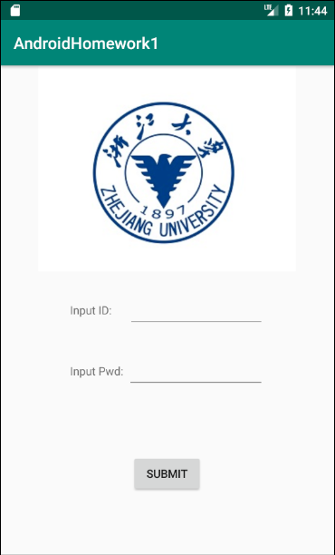
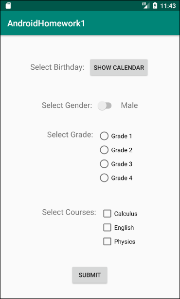
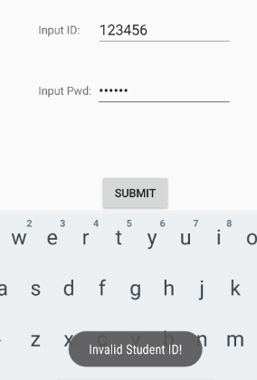
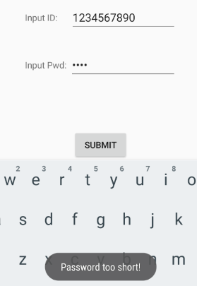
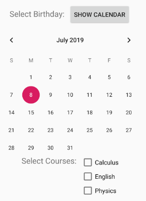

## 浙江大学安卓开发小学期 作业1

> 姓名：朱璟森
>
> 学号：3170104166
>
> 专业：计算机科学与技术

****

### 作业要求

创建一个Android app工程，使用5种以上的View并实现一些简单交互

### 作业展示

本次作业中实现了一个类似于登录与信息问卷的简易程序，由2个页面组成，分别截图：

第一个页面由`TextView`, `EditText`, `Button`, `ImageView`四种控件组成，输入学号和密码，点击"Submit"按钮进入下一个界面。提交时会有简易的合法性检查，如果学号不等于10位数字或密码不足6位会通过`Toast`弹出错误提示：

第二个页面由`TextView`, `Button`, `Switch`, `CheckBox`, `RadioBox`五种控件组成，其中的`Switch`切换状态会在性别男、女间互换。而点击"Show Calendar"则会弹出一个`CalendarView`控件：

而点击"Submit"按钮则会回到输入学号密码的第一个界面。

本次作业中两个界面的布局均采用`RelativeLayout`进行设置，其中部分地方在主布局的基础上嵌套使用了水平方向的`LinearLayout`。

### 总结与心得

本次作业是我开发的第一个安卓APP，通过上课与自己网上检索，学会了控件布局、事件监听器、界面切换等基本操作。希望在之后的课程中不断锻炼自己，开发出更好的APP。